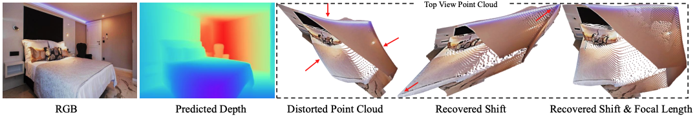

# 3D-Shape-Recovery
Implementation from scratch of Learning 3D Shape Recovery using Point Cloud Module and Depth Monocular Prediction

This shows an example of 3D-scene shape reconstruction. Image was taken from Yin et al. (2020) The predicted depth map in the second image and its accurate 3D reconstruction in the fifth image.

## Datasets

<b>Taskonomy</b>: available <a href="https://github.com/StanfordVL/taskonomy/tree/master/data">here</a>. This is the main dataset that was used on to train PCM and DPM modules. It is comprised of large and high-quality images of varied indoor scenes. It is 11.16 TB in size but we are only using a subset (RGB dataset for DPM, 512x512 resolution; depth_zbuffer dataset for PCM, z-buffer depth images) 

### Other Potential Datasets

These are datasets that we could have used in addition to Taskonomy for training (but we hadn't due to time constraints and extremely large data):

<ul>
   <li> <b>ScanNet</b>: available <a href="https://github.com/ScanNet/ScanNet">here</a> </li>
  <li> <b>DIML</b>: <a href="http://diml.yonsei.ac.kr/DIML_rgbd_dataset/">here</a>, but link is broken </li>
  <li> <b>Ken Burns</b>: available <a href="https://github.com/sniklaus/3d-ken-burns">here</a> </li>
</ul>

### Testing Datasets

<ul>
  <li> <b>KITTI</b>: available <a href="https://paperswithcode.com/dataset/kitti">here</a>. One of the more popular benchmark datasets for mobile robotics and autonomous driving. </li>
  <li> <b>DIODE</b>: available <a href="https://diode-dataset.org/">here</a>. High-resolution, accurate, dense RGB colored images. </li>
   <li> <b>Youtube3D</b>: available <a href="http://www-personal.umich.edu/~wfchen/depth-in-the-wild/">here</a> (Didn't have time to use) </li>
</ul>

## Methodology

The framework consists mainly of two main modules: the Point Cloud Module (PCM) and the Depth Predcition Module (DPM). These modules are trained separately; however, during inference time, the output of the DPM becomes the input of the PCM.

## Reproduced Experimental Results

| Dataset: DIODE  | Yin et al. (2020) |  Ours  |
| --------------- | ----------------- | ------ |
| Baseline        |        46.8       |  120.3 |
| After shift     |      **36.9**     | **94.26** |

Results from shift recovery experiment. This demonstrates that the depth shift error was reduced from the grond truth depth.

|       Model      |  Backbone  |  Loss  |
| ---------------- | ---------- | ------ |
| Yin et al.       |  ResNet50  |  **14.3** |
| Yin et al.       | ResNeXt101 |  14.9 |
| Our Reproduction |  ResNet50  | 176.8 |
| Our Reproduction | ResNeXt101 | 177.2 |

Depth prediction losses of the models on the KITTI dataset. In bold is the performance loss from the best model 

## Project Materials

**Video and Presentation Slides:** https://tinyurl.com/3d-shape-recovery-video  
**Paper Report:** https://tinyurl.com/proj-report-3d-shape-recovery

## References

<ul>
   <li> Wei Yin, Jianming Zhang, Oliver Wang, Simon Niklaus, Long Mai, Simon Chen, and Chunhua Shen. 2020. Learning to Recover 3D Scene Shape from a Single
Image. arXiv:2012.09365 [cs.CV] </li>   
</ul>
